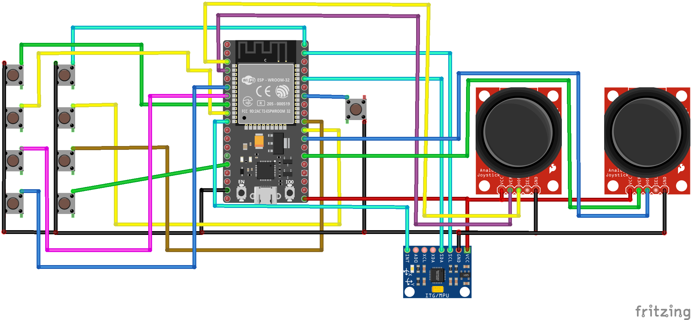

# ESP32 gamepad with gyroscope

This work is licensed under the terms of the GNU General Public License v3 (see the LICENSE).

## About

- This project is the implementation of a gamepad with a built-in gyroscope making the gamepad capable of controlling left or right joystick with tilt. 
- The gamepad is connected via Bluetooth Low-Energy.

- The code is based on the code from [this article](https://www.instructables.com/DIY-ESP32-Bluetooth-GamePad-for-Android-PlayStatio/) and [the example from i2cdevlib](https://github.com/jrowberg/i2cdevlib/blob/master/Arduino/MPU6050/examples/MPU6050_DMP6/MPU6050_DMP6.ino).

## Controls

Modes are switched using the button defined as MODE_BUTTON in main.cpp.

By default the gamepad is in normal mode (i.e. no gyroscope).

To switch to the gyroscope mode or back to normal mode, press MODE_BUTTON 3 times. 

In gyroscope mode:

- Single click - recalibrate the gyroscope and accelerometer (set the current pose of the gamepad as the resting pose).
- Double click - select which joystick is emulated by the gyroscope.

## Required components 

- Any ESP32 board.
- An MPU6050 IMU.
- 2 analog joysticks.
- 9 push-buttons.

## Wiring

Used pins can be reassigned by changing defines in main.cpp.

## TODO

In my plans I want to implement the following:

- Add L1, L2, R1, R2.
- Wired USB connection.
- Develop a PCB and a 3D model of a case.